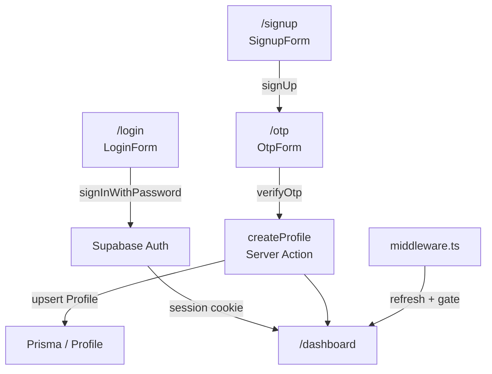

# `apps/admin` Architecture

Authentication, rendering, data flow, and state management for the admin portal.

---

## Authentication flow



### Middleware

`apps/admin/middleware.ts`:

- Refreshes the Supabase session on every request.
- Redirects unauthenticated visitors from protected routes to `/login`.
- Redirects authenticated visitors away from `/login`, `/signup`, `/otp` to `/dashboard`.
- **Known boundary**: gates on session presence only; `TODO` notes `User.role === ADMIN` enforcement is not yet wired.

### Supabase clients

| Client | Path | Use |
|---|---|---|
| Browser | `src/lib/supabase/client.ts` | Login, signup, OTP, sign-out forms |
| Server (cookie) | `src/lib/supabase/server.ts` | Server Components / Server Actions needing auth context |
| Service role | `src/lib/supabase/admin.ts` | Invite users via `inviteUserByEmail` |

### Profile creation

After OTP confirmation, `src/modules/auth/otp-form/actions.ts` creates a `Profile` row in Prisma. Login also attempts to upsert a `Profile` for back-compat.

---

## Rendering model

- Next.js 16 App Router with Server Components by default.
- `(dashboard)` is a route group with a shared shell layout (`src/app/(dashboard)/layout.tsx`).
- Public auth routes (`/login`, `/signup`, `/otp`) live outside the route group.
- Dashboard pages are async Server Components that query `prisma` directly.
- Tables, forms, and dialogs are client components co-located with their page.

---

## Data flow

```text
Server Component (page.tsx)
  → prisma query (direct)
  → prefetchQuery + HydrationBoundary
  → Client table/form (React Query + TanStack Table)

Mutation
  → Client form / dialog
  → Server Action (actions.ts)
  → prisma or Supabase admin
  → revalidatePath
  → Client refetches
```

- Read queries use `prisma` directly in Server Components or via `use-*/server.ts` for prefetch.
- Mutations use route-colocated `actions.ts` files marked `"use server"`.

---

## State management

- **TanStack Query** — server-state caching and hydration.
- **next-themes** — theme toggle (no Redux in admin).
- **sonner** — toast notifications for errors and success.

---

## Shared package wiring

### `@fe-template/ui`

- Imported via `import { ... } from "@fe-template/ui"`.
- Transpiled by `transpilePackages: ["@fe-template/ui"]` in `next.config.ts`.
- Scanned by Tailwind via `@source "../../../../packages/ui/src/**/*.{ts,tsx}"` in `globals.css`.

### `@fe-template/db`

- Imported in Server Components, Server Actions, and API routes only.
- Server-only. Never import from client components.

---

## Important boundaries

- Auth gates on session presence, not role. Any authenticated Supabase user can currently access the dashboard.
- `@fe-template/db` and `src/lib/supabase/admin.ts` must not be imported from client components.
- `src/login/` is an empty leftover directory. Use `src/app/login/`.
- Signup form references `/auth/callback` which does not exist.
